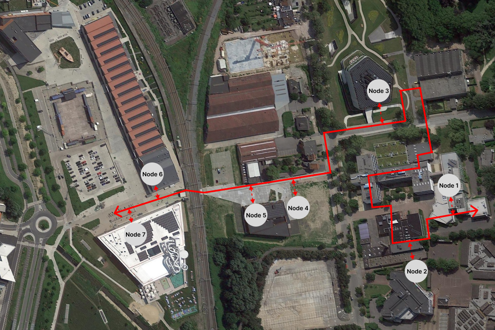

# Gebruik model EMS DOE

Eerst en vooral zijn er verschillende dingen nodig om het model te kunnen runnen:

* Geldige solver: het model is een MQCQP model, ik raad [Gurobi](https://www.gurobi.com/academia/academic-program-and-licenses/) aan, gratis academische licentie is te verkrijgen.

* Om gemakkelijk te werk te gaan raad ik aan om in een [Conda](https://docs.conda.io/projects/conda/en/latest/user-guide/install/windows.html) environment het model te runnen en zo duidelijk de geinstalleerde libraries en eventueel solvers op 1 plek te hebben.

* Benodigde libraries:
    + numpy
    + MatPlotLib
    + sklearn.linear_model _(Linear approximation)_
    + Pandas
    + pyomo
    + itertools

Eenmaal alles geinstalleerd is kan je beginnen aan het runnen van het model:

### Data

#### Verbruik

Verbruik data neemt het volgende formaat aan: (Lengte van de dataset maakt niet uit, dit kan voor 1 dag, 1 jaar of 10 jaar gesimuleerd worden indien alle data beschikbaar is)

| index | Collectief | KWEA     | Penta    | Vegitec  | LAGO     | PTI      |
|-------|------------|----------|----------|----------|----------|----------|
| 0     | 598.4354   | 206.5241 | 582.1955 | 26.77193 | 461.5463 | 244.8322 |
| 1     | 595.4495   | 205.4937 | 579.2906 | 26.63835 | 701.8358 | 243.6106 |
| 2     | 590.9109   | 203.9274 | 574.8752 | 26.43531 | 701.8358 | 241.7538 |
| 3     | 587.5069   | 202.7526 | 571.5637 | 26.28303 | 223.6358 | 240.3612 |
| 4     | 587.6861   | 202.8145 | 571.738  | 26.29104 | 461.5463 | 240.4345 |
| 5     | ...        | ...      | ...      | ...      | ...      | ...      |

#### Prijssettings

Nog omzetten naar csv in code

#### Productie eenheden
Alles per productie eenheid:
* Type _(CHP of boiler)_
* Maximale output _(in kW)_
* Ramprates (meet hoe snel een installatie zijn output kan wijzigen)

#### Algemene model inputs
* Toevoer en aanvoer temperaturen
* $C_p$ waarde van water ($4.186 \frac{J}{g°C}$)
* Afname kost _(zoals besproken 0.25EUR/kWh)_
* Warmteverlies lineare approximation _(als input van het Heatloss_calculation.py bestand die een csv output)_

## Heatloss_pumppower_calculations.py

Het bestand Heatloss_calculation.py zorgt voor de pompvermogen berekeningen van de leidingen en doordat de berekeningen omtrent pompvermogen sterke non-linear zijn word een lineaire approximatie uitgevoerd, voor elke pijpsectie word daarna als csv geoutput.



#### Pompvermogen approximatie

De calculatie neemt als input de lengte van de leidingen als volgt: (benamingen volgens topologie)

```
Length_1_2 = 50
Length_2_3 = 120
Length_3_4 = 173
Length_4_5 = 331
Length_5_6 = 112
Length_6_7 = 100
Length_7_8 = 50
```

Daarna worden algemene leidingsparameters berekend met volgende inputs:
```
rho = 971.8
D_pipe = 0.125
A_pipe = 3.1415*(D_pipe/2)**2
dyn_visc = 0.000355
rel_roughness = 0.00004
HX_dP (drukverlies warmtewisslaars [zoals besproken met Kim])= 15000
```

Daarna wordt geitereerd tussen 0 en 40 m/s massastromen om een lineare approximatie uit te voeren met volgende berekeningen:

$
v = \frac{m}{\rho_w A}$

$Re_{i,j,t} = \frac{\rho_w v d}{\mu}$

$f=0.0055(1+(2\cdot 10^4 \frac{k}{d} + \frac{10^6}{Re})^{1/3})$

$\Delta p = \frac{L}{d}f\rho_w \frac{v^2}{2}$

$NW^{loss} = 2(\Delta p + p_{drop}^{HX})$

$P^{pump} = \frac{v\cdot  NW^{loss}}{\eta^{pump}}$

Het belangrijkste om hier te begrijpen is dat de pompbenodigdheid afhankelijk is is van zowel drukverlies als massastroom, in het model wordt dit geintegreerd aan de hand van de massastroom omdat de lineare apprixmatie uitgedrukt is in functie van de massastroom.

#### Warmteverlies berekeningen

```
lamda_g = 1.5 (grond warmteoverdrachtcoefficient)
Tg = 15 (grond temperatuur)
alpha = 1.72*(Tg-20)*0.33 (warmteoverdrachtscoëfficiënt van grondoppervlak naar lucht)
h_accent = 2 + lamda_g/alpha (gecorrigeerde diepte van leidingen)
b =0.01 (afstand tussen centra van leidingen)
lambda_i = 0.028 (warmtegeleiding isolatie)
du = 0.130 (buitendiameter isolatie)
ds = 0.125 (binnendiameter isolatie)
Ts = 70 (toevoer temp)
Tr = 50 (retour temp)
```
Warmteverlies word berekend aan de hand van leiding specificaties, $\lambda_g$, $\lambda_i$, $T_g$ zouden in principe hetzelfde blijven voor eender welke simulatie, afhankelijk van de leidingen kunnen leiding specificaties aangepast worden.

Het script print($\Phi$) warmteverlies per lengte-eenheid ($\frac{W}{m}$)

$\Phi = 2K(\frac{T_s+T_r}{2} - T_g)$ (warmteverlies per lengte-eenheid)
$K = \frac{1}{R_1+R_M}$ (gecombineerde warmteoverdrachtsfactor)

$R_I = \frac{1}{2\pi\lambda_I}\ln{\frac{d_u}{d_s}}$ (weerstand voor warmtegeleiding van de isolatie)

$R_M = \frac{1}{2\pi\lambda_g}\ln{\sqrt{1+4(\frac{h'}{b})^2}}$ (weerstand voor warmtegeleiding van isolatie en de combinatie)

## HeatNet.py

Alle model bestanden beginnen met het opmaken van de sets van de powerplants, in het algemeen omdat het maximale aantal productie eenheden 3 is voor alle verschillende nodes staat het momenteel op 3 verschillende plants per node. 

Nodelist is vanzelfsprekend en beschrijft het aantal nodes in het systeem.
```
node_list = [1,2,3,4,5,6,7]
Plants = ['Plant1', 'Plant2', 'Plant3']
```

Daarna worden de consumptions binnengelezen en word de set met de verschillende tijdsiteraties ($\Tau$) opgemaakt:
$\Tau$ wordt automatisch opgemaakt door de lengte van één van de consumptiepatronen te nemen.

```
Times = len(df['KWEA'].values.tolist())
time_list = list(range(1, Times))
```

Daarna worden de verschillende verbruiksprofielen binnengelezen en omgezet naar een matrix met juiste index, index zijnde verbruik voor iedere node $i$ op tijdstip $t$. Dit wordt dan in één dictionary verzameld om dan als input te gebruiken voor een Parameter in het model:

een voorbeeld van een entry met de respectievelijke index: $(1,1) = 200$ dit wil zeggen het verbruik voor node 1 op tijdstip 1 is gelijk aan 200kW

```
demand_list_node1 = df['KWEA'].values.tolist()
demand_list_node2 = df['PTI'].values.tolist()
demand_list_node3 = df['KWEP'].values.tolist()
demand_list_node4 = df['Vegitec'].values.tolist()
demand_list_node5 = df['QUBUS'].values.tolist()
demand_list_node6 = df['LAGO'].values.tolist()
demand_list_node7 = df['HangarK'].values.tolist()
demand = {}

for i in node_list:
    demand_list = globals()[f"demand_list_node{i}"]
    for time, d in zip(time_list, demand_list):
        demand[(i, time)] = d
```

Daarna wordt op dezelfde manier de prijzen binnengelezen en omgezet naar matrix met de juist index met enige verschil dat de prijssetting variabelen index $(i,p,t)$ hebben waar i de node, p de powerplant en t de tijd voorstellen. Dit betekend dat het mogelijk is om voor elke node en elk verschillende productieenheid bij die node een verschillende prijssetting kan gegeven worden doorheen de tijd.

```
for i in node_list:
    for j in Plants:
        price_list = globals()[f"price_list_node{i}_{j}"]
        for time, price in zip(time_list, price_list):
            prices[(i, j, time)] = price
```

Het volgende stuk code omvat een selectie van back of forward flow doorheen het warmtenet afhankelijk van de verbruiken tegenover het midden als referentiepunt. (In principe kiest het model voor 100% forward flow dus Howest richting LAGO) dus is dit stuk niet direct nodig. De keuze wordt vooraf gemaakt en als 2 verschillende tijdsets naar het model gestuurd.

```
T_forward_flow = []
T_backward_flow = []

for i in range(len(demand_list_node1)-1):
    if demand_list_node1[i] < 525.7 and demand_list_node2[i] < 2697:
        T_forward_flow.append(i+1)
    else:
        T_backward_flow.append(i+1)

print(len(T_forward_flow))
print(len(T_backward_flow))
```

Het volgende is het binnenlezen van de lineare approximatie van de pompkosten, hier hoeft niks aangepast te worden.

##### Input sets model

Een belangrijk onderdeel van het model is het aanwijzen van type powerplant aan de juiste powerplant en juiste node. 

Neem bijvoorbeeld dat Plant1 bij node 1 een CHP plant is wordt deze als volgt in de set van CHP plants toegevoegd, je kan hier van afleiding dat de variabelen geindexeerd over deze CHP set geindexeerd zullen zijn volgens (Plantx, node):

CHP_plants ={
    **(1, 'Plant1')**,(3, 'Plant1')
}

``` 
HOB_plants ={
    (1, 'Plant2'),(1, 'Plant3'),
    (2, 'Plant1'),(2, 'Plant2'),(2, 'Plant3'),
    (3, 'Plant2'),(3, 'Plant3'),
    (4, 'Plant1'),(4, 'Plant2'),(4, 'Plant3'),
}
``` 
Voor HOB exact hetzelfde principe, let ook op sinds de set plants voor iedere node 3 plants omvat moeten alle plants verdeeld worden over deze 2 sets (Het is mogelijk dat een node maar 1 powerplant heeft, dan wordt de output power op 0 gezet wat die exacte powerplant overbodig maakt.)

Het model bestaat uit volgende sets:
``` 
model.N = Set(initialize=node_list) (aantal nodes)
model.T = Set(initialize=time_list) (aantal tijdsiteraties)
model.T_forward = Set(within=model.T, initialize=T_forward_flow) (tijdsiteraties in forward flow)
model.T_backward = Set(within=model.T, initialize=T_backward_flow) (tijdsiteraties in backwards flow)
model.Plants = Set(initialize=Plants) (Plants per node)
model.CHP_Plants = Set(within=model.N * model.Plants, initialize=CHP_plants) (super set combinatie nodes en plants voor CHP plants)
model.HOB_Plants = Set(within=model.N * model.Plants, initialize=HOB_plants) (super set combinatie nodes en plants voor HOB plants)
```

##### Model Parameters

Het model bestaat uit verschillende parameters:

_Parameters are data that must be provided in order to find an optimal (or good) assignment of values to the decision variables._

De belangrijkste aanpassingen voor het testen van het model staan aangeduid met een pijl:

``` 
model.Injectieprijs = Param(initialize=0.16) <--
model.Cgen = Param(model.N, model.Plants, model.T, initialize=prices)  <--
model.Ts = Param(initialize=60)  <--
model.Tr = Param(initialize=40)  <--
model.Cp = Param(initialize=4.18)
model.lengths = Param(model.N, initialize={1:50, 2:120,3:331,4:173,5:112,6:100,7:50})
model.coefficients = Param(model.N,initialize=coefficients_LC)
model.intercepts = Param(model.N,initialize=Intercepts_LC)
model.Afnamekost = Param(initialize=0.25)  <--
``` 

Een ander belangrijk onderdeel van het modelleren van CHP is de feasible operation area, sinds alle powerplants verschillende power-to-heat ratios hebben zijn deze hardcoded:

``` 
model.yA = Param(model.CHP_Plants, initialize={
    (1, 'Plant1'): 140, (3, 'Plant1'):288, (6, 'Plant1'):140
})

model.xA = Param(model.CHP_Plants, initialize={
    (1, 'Plant1'): 0, (3, 'Plant1'):0, (6, 'Plant1'):0
})

model.xB = Param(model.CHP_Plants, initialize={
    (1, 'Plant1'): 207, (3, 'Plant1'): 232, (6, 'Plant1'):140
})

model.yB = Param(model.CHP_Plants, initialize={
    (1, 'Plant1'): 112, (3, 'Plant1'): 230.4, (6, 'Plant1'):112
})

model.xC = Param(model.CHP_Plants, initialize={
    (1, 'Plant1'): 42, (3, 'Plant1'): 115.5, (6, 'Plant1'):112
})

model.yC = Param(model.CHP_Plants, initialize={
    (1, 'Plant1'): 89.6, (3, 'Plant1'): 184.32, (6, 'Plant1'):56
})

model.xD = Param(model.CHP_Plants, initialize={
    (1, 'Plant1'): 0, (3, 'Plant1'):0, (6, 'Plant1'):0
})

model.yD = Param(model.CHP_Plants, initialize={
    (1, 'Plant1'): 70, (3, 'Plant1'): 144, (6, 'Plant1'):70
})
``` 
Punten zijn gedifinieerd als:

##### Model variabelen

Het model bepaald de waarde van de variabelen afhankelijk hoe ze geindexeerd zijn:

